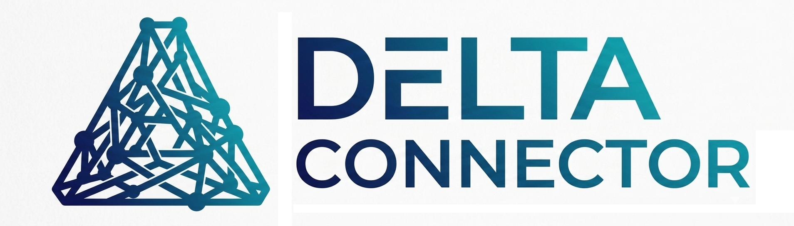

<p align="center">
  
</p>

<h1 align="center">Delta Connector</h1>

<p align="center"><strong>The agentic trust layer for Berlin's startup ecosystem.</strong></p>

Delta Connector turns hidden startup-ecosystem knowledge into a trusted, searchable, agentic network where founders and stakeholders find the right people, answers, services, and resources through peer-validated recommendations.

> No founder should need the right private WhatsApp group to know whom to ask, who to trust, or what to do next.

Full spec: [`pdr/product_requirements_document.md`](pdr/product_requirements_document.md).

---

## The problem

Founders rely on informal networks (WhatsApp groups, alumni networks, private intros) to find lawyers, tax advisors, co-founders, investors, housing, and answers to specific questions. That knowledge is fragmented and invisible to anyone without an existing network, so every founder starts from scratch, good answers are never reused, and founder knowledge doesn't compound. Delta Connector turns recommendations, answers, and relationships into structured, trusted, reusable ecosystem knowledge.

## What it is

A peer-validated ecosystem graph + agentic navigator + reusable Q&A layer. It helps users answer four questions: **Who can help me? What has already been answered? Who is trusted for this exact problem? What should I do next?**

## Two core flows (the demo)

1. **Join, contribute, build trust** — sign up, pick stakeholder type, create a profile, optionally recommend 1–8 people, see private trust metrics. Recommended people stay invisible until they confirm and opt in.
2. **Ask, discover, reuse answers** — ask a question, get matched to previous trusted answers (smart-FAQ style) with anonymized trust evidence, mark one as fitting, request a follow-up, or post publicly if nothing fits. Helpful answers become reusable knowledge and raise the provider's trust metrics.

Demo persona: Maya, a non-EU AI-SaaS founder arriving in Berlin in six weeks, needing housing, Anmeldung, GmbH setup, a tax advisor, coworking, and pre-seed funding.

---

## Key decisions (from the PRD)

**Core principles**
- **Trust-unlocked, not hard-gated** — join first; contribution improves trust, visibility, and access. Users can recommend 1–8 people after joining.
- **Confirmed opt-in only** — invitees never appear in the public graph before confirming. Until then they're private pending-invite records visible only to the inviter.
- **Peer validation is the trust anchor** — full verification needs validation from 8 founders.
- **Multi-label identity** — an actor can be e.g. Founder + Angel, or Lawyer + Mentor.
- **Anonymized trust first** — users see evidence ("Recommended by 4 verified founders in your stage") before any identity is revealed; reveal requires meaningful interaction and consent.
- **Agentic but human-controlled** — the agent recommends, drafts, matches, and prepares actions; it never sends messages, reveals private data, or makes binding commitments without approval.
- **Paid investor access without ranking influence** — investors may pay for opt-in discovery; payment never affects ranking or trust.

**Trust score (MVP formula, PRD §16.4)** — founder validations 25%, impact 20%, answer helpfulness 20%, category fit 15%, stage/context fit 10%, recency 5%, confirmation 5%. Levels: 70–79 trusted (private recommend), 80+ unlocks public category badges.

**Agent forbidden actions (safety-critical, PRD §17.4)** — never send messages without approval; never reveal private data without consent; never expose unconfirmed invitees; never rank paid investors higher; never make final legal/tax/immigration/investment decisions.

**Data model (PRD §18)** — Actor, FounderProfile, RecommendationReceipt, Answer, Question, GraphEdge, MatchResult.

**MVP non-goals (PRD §12)** — no payment processing, marketplace, public leaderboard, cold outreach, social feed, full messaging, autonomous booking, or visible nodes for unconfirmed invitees.

---

## Architecture

- **Client** — React (Next.js or Lovable-generated) + Tailwind; React Flow / Cytoscape.js for the graph. Thin client: it consumes the API and renders, never reimplements business logic.
- **Backend** — API services for auth, profiles, recommendations, Q&A, graph, matching, and agent orchestration. Recommended: Supabase (Auth + Postgres + pgvector). Hackathon stand-in: in-memory/seed JSON, clearly marked.
- **Agent layer** — MVP is one orchestrated LLM prompt with structured outputs (modes: Answer Retrieval, Matching, Question Routing, Metric Coach, Outreach, Insight). Workflow engine is post-MVP.
- **Data** — relational for users/answers, graph tables for relationships, vector search (pgvector) for previous-answer retrieval.

See [`docs/API_CONTRACT.md`](docs/API_CONTRACT.md) for endpoint shapes — the source of truth between backend and frontend.

---

## Team & specialized agents

Three of us build in parallel, with five Claude Code subagents in [`.claude/agents/`](.claude/agents) to assist:

| Person | Owns | Assisting agent |
| --- | --- | --- |
| Nicolai | Data model + trust-graph core | — |
| Ian | Backend + agent orchestration | `backend-coder` |
| Lauritz | Frontend (Lovable/React) + demo + seed data | `frontend-coder` |

- **`task-planner`** — turns the PRD + repo state into the next tasks per person, with verifiable checks. Consults the `architect` when a request has design implications.
- **`architect`** — advises on system design and tradeoffs (data model, orchestration, API shape, build sequencing); advisory and read-only. The task-planner and coders consult it before architectural decisions.
- **`test-engineer`** — writes/runs tests against PRD acceptance criteria; treats privacy and agent-forbidden-action rules as must-pass.
- **`backend-coder`** — API, data model, orchestration, trust score; stays within the API contract.
- **`frontend-coder`** — the eight build-plan screens; thin client over the API.

All agents follow [`.claude/skills/engineering-discipline.md`](.claude/skills/engineering-discipline.md): state assumptions, simplest solution, surgical changes, goal-driven execution.

## Run the backend

```
cd backend
pip install -r requirements.txt
uvicorn app:app --reload   # http://localhost:8000, docs at /docs
python ../tests/test_agents.py   # run tests
```

## Repo layout

```
backend/        FastAPI app, agents (matchers, answer-retrieval, outreach, metrics), seed data
docs/           API_CONTRACT.md, PLAN.md, IMPLEMENTATION_PLAN.md
pdr/            product_requirements_document.md + design drafts
pics/           logos: full + triangle, each in solid and -transparent variants (frontend uses transparent)
frontend/       fallback-components (CursorHighlight, TrustGraph, AnimatedAnswerCard)
.claude/        agents/ (5 subagents), skills/ (engineering discipline)
tests/          zero-dependency test harness
CLAUDE.md       project context for Claude Code sessions
```
