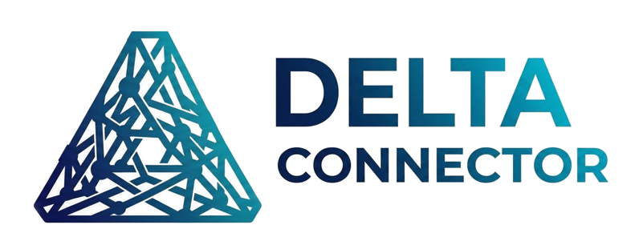

<p align="center">
  
</p>

<h1 align="center">Delta Connector</h1>

<p align="center"><strong>The agentic trust layer for Berlin's startup ecosystem.</strong></p>

<p align="center">
  <em>No founder should need the right private WhatsApp group to know whom to ask, who to trust, or what to do next.</em>
</p>

<p align="center">
  <a href="https://www.loom.com/share/4bb6f0b2ad0a4488b4b0895cd6db806a"><strong>&#9654;&nbsp; Watch the 3-minute pitch &amp; demo (Loom)</strong></a>
</p>

---

Delta Connector turns the hidden knowledge of a startup ecosystem - the lawyers, tax advisors,
co-founders, investors and hard-won answers that today live in private WhatsApp groups and
alumni networks - into a **trusted, searchable, agentic network**. Founders find the right
people, the right answers, and the right next step through **peer-validated** recommendations,
not luck of the draw.

Built at a Berlin hackathon by a team of three, with an agentic backend, an SSR React frontend,
and a curated dataset of 38 real-shaped Berlin ecosystem champions & mentors answering 50 real
founder questions.

---

## Table of contents

- [The problem](#the-problem)
- [What it is](#what-it-is)
- [Demo video](#demo-video)
- [Screenshots](#screenshots)
- [Core flows](#core-flows)
- [The agents (all working)](#the-agents-all-working)
- [Architecture](#architecture)
- [Tech stack](#tech-stack)
- [API reference](#api-reference)
- [Trust model](#trust-model)
- [Data](#data)
- [Local development](#local-development)
- [Deployment](#deployment)
- [Repo layout](#repo-layout)
- [Team](#team)
- [License](#license)

---

## The problem

Founders rely on informal networks to find lawyers, tax advisors, co-founders, investors,
housing, and answers to very specific questions ("Which Berlin notary has the shortest wait
for a GmbH?"). That knowledge is fragmented and invisible to anyone without an existing
network. So every founder starts from scratch, good answers are never reused, and the
ecosystem's collective knowledge never compounds.

Delta Connector turns recommendations, answers, and relationships into **structured, trusted,
reusable** ecosystem knowledge.

## What it is

A **peer-validated ecosystem graph** + **agentic navigator** + **reusable Q&A layer**. It helps
a user answer four questions:

1. **Who can help me?**
2. **What has already been answered?**
3. **Who is trusted for this exact problem?**
4. **What should I do next?**

Demo persona: **Marco Bianchi**, a non-EU AI-SaaS founder newly arrived in Berlin - needing a
tax advisor, GmbH setup, coworking, and a pre-seed network, starting with a trust score of 19/100.

## Demo video

**Pitch & live demo (~3 min):** https://www.loom.com/share/4bb6f0b2ad0a4488b4b0895cd6db806a

The walkthrough follows the full demo spine: Landing -> Onboarding -> Ask a question ->
"This answer fits" -> champion profile reveal -> request follow-up -> personal Dashboard.

## Screenshots

### 1. Landing - "Connect to the people you need. Succeed faster."

<p align="center"></p>

The marketing entry point. A full-bleed Berlin conference-hall hero sits behind a white glass
gradient, with the value proposition front and centre: *the connective layer for Berlin's
startup ecosystem - turning the trusted advice buried in WhatsApp groups into searchable,
peer-sourced knowledge.* A live **Ask & Discover** search card (styled like a desktop window,
`delta-connector.app / ask`) lets a visitor try a real question - e.g. *"Which tax advisor is
good for a VC-backed GmbH in Berlin?"* - before signing up. Trust cues at the bottom:
*Privacy-first by design - Peer-validated - Compounding value.*

### 2. Dashboard - private trust metrics & agentic next steps

<p align="center"></p>

The logged-in home for **Marco Bianchi** (AI SaaS - Pre-Seed - Non-EU Founder - Berlin). The
glass sidebar carries the full navigation (Home, Ask, My Profile, Recommend, Graph, My Network,
Dashboard). The **Metric Coach agent** surfaces a recommended next action and an at-a-glance
metric strip: **Trust Score 19/100** (+ this week), Contribution, **Helpfulness 4.8/5**,
Network Reach, **Categories 7/16**, and saved answers. Below, *Recommended next steps* are
agent-generated and tied to the trust formula (add recommendations in underrepresented
categories, answer a public question, request a follow-up from a verified Tax/Admin contributor),
alongside a live *Recent activity* feed. Metrics are private by design.

### 3. Ask & Discover - the "answer fits" champion reveal

<p align="center"></p>

The heart of the product. The **Answer Retrieval agent** returns previous trusted answers as
ranked cards with anonymized trust evidence (*"Top-expert answer - score 4.9/5 - helpful for 22
founders"*) and a relevance match score. The provider stays hidden until the founder clicks
**"This answer fits."** On confirmation, the answer text shrinks left and the matched champion's
**full profile is revealed on the right** - here **Stefan Krawczyk**, Mentor - Fundraising & VC,
Berlin Mitte, with bio, strengths (term-sheet negotiation, investor relations, B2B SaaS, Series A
prep) and live stats (**Trust 87 - Helped 62 - Reach 2.1k**) - plus **Connect** (prefilled email)
and **Send a message** actions. The Outreach agent drafts the follow-up; nothing is sent without
the user's approval.

## Core flows

**1. Join, contribute, build trust.** Sign up, pick a stakeholder type, create a profile,
optionally recommend 1-8 people, and see your private trust metrics. Recommended people stay
invisible until they confirm and opt in.

**2. Ask, discover, reuse answers.** Ask a question, get matched to previous trusted answers
(smart-FAQ style) with anonymized trust evidence, mark one as fitting, request a follow-up, or
post publicly if nothing fits. Helpful answers become reusable knowledge and raise the
provider's trust metrics.

---

## The agents (all working)

The backend is an **orchestrator + five specialized agents** (plus a shared session store). Every
agent is implemented and wired to a live FastAPI endpoint - the frontend calls them in the demo.

> **Honest note on intelligence.** For the hackathon build each agent is a **deterministic,
> rule-based stand-in** (keyword + category + score heuristics) rather than an LLM call. This is
> intentional: it makes the demo fast, free, and fully reproducible. The orchestration boundaries,
> API contract, consent gates and trust math are real and production-shaped - the drop-in for a
> real LLM (and pgvector retrieval) is a single layer, documented in `docs/IMPLEMENTATION_PLAN.md`.

| Agent | File | Endpoint(s) | What it does |
| --- | --- | --- | --- |
| **Answer Retrieval** | `backend/agents/answer_retrieval.py` | `POST /ask` | Retrieves previous answers, scores them by category + question-text + stage match, returns ranked `MatchResult` cards with anonymized trust evidence. Never surfaces an answer whose provider has not opted in. |
| **Champion Matcher** | `backend/agents/champion_matcher.py` | `POST /match`, `GET /champions` | Matches a need to ecosystem champions by field + strengths keyword overlap, returns scored matches with reasons. |
| **Mentor Matcher** | `backend/agents/mentor_matcher.py` | `POST /match`, `GET /mentors` | Ranks mentors by industry fit plus local tenure (years in Berlin) - newcomers benefit from domain + local experience. |
| **Outreach** | `backend/agents/outreach.py` | `POST /follow-up-draft` | Drafts a short, polite follow-up to an answer provider **only when consent is given**. Returns a draft for the user to approve/edit - it never sends, and never reveals identity on its own. |
| **Metric Coach** | `backend/agents/metrics.py` | `GET /metrics`, `POST /answer-fits` | Computes private metrics + the MVP trust score from weighted signals, generates the "improve your metrics" coaching tip, and records "answer fits" events that bump helpfulness. |
| **Fit Store** | `backend/agents/fit_store.py` | (shared) | In-memory overlay for `/answer-fits` bumps so the "watch the number go up" demo works even on ephemeral/read-only hosts. Resets on restart. |

**Orchestrator** (`backend/app.py`) composes these behind one FastAPI app, routes each request to
the right agent(s), and enforces the response contract in `docs/API_CONTRACT.md`.

**Agent-forbidden actions (safety-critical, enforced):** never send messages without approval;
never reveal private data without consent; never expose unconfirmed invitees; never rank paid
investors higher; never make final legal/tax/immigration/investment decisions.

### The agent pipeline visual

On the Ask screen, a four-stage animation (Retrieval -> Category fit -> Trust check -> Ranking)
visualizes how the system reasons about a question. It is an **illustration of the flow** - the
real work is the single `/ask` retrieval call - and is clearly a presentation layer, not four
separate network services.

---

## Architecture

```
                    +-----------------------------------------------+
                    |  Frontend - TanStack Start (React 19, SSR)    |
                    |  Vite 7 - Tailwind 4 - Nitro (node-server)    |
                    |  8 screens: Landing, Onboarding, Home, Ask,   |
                    |  Profile, Recommend, Network (graph), Dashboard|
                    +-----------------------+-----------------------+
                                            |  fetch (VITE_API_BASE)
                                            v
                    +-----------------------------------------------+
                    |  Backend - FastAPI orchestrator (app.py)      |
                    |                                               |
                    |   /ask -------------> Answer Retrieval agent  |
                    |   /match,/champions -> Champion Matcher       |
                    |   /match,/mentors ---> Mentor Matcher         |
                    |   /follow-up-draft --> Outreach agent         |
                    |   /metrics,/answer-fits -> Metric Coach       |
                    |                          + Fit Store (memory) |
                    +-----------------------+-----------------------+
                                            |
                                            v
                    +-----------------------------------------------+
                    |  Data - seed JSON (champions, answers,        |
                    |  activity) + curated champions.ts dataset     |
                    |  Production drop-in: Supabase (Postgres +      |
                    |  pgvector) - see IMPLEMENTATION_PLAN.md        |
                    +-----------------------------------------------+
```

- **Client** is a thin SSR React app: it consumes the API and renders, and never reimplements
  business logic. The trust graph (My Network) is an interactive canvas; the rest are standard
  routed screens with a shared glass-sidebar shell.
- **Backend** is a single FastAPI process exposing the agent endpoints behind a stable contract.
- **Agent layer** is the orchestrator + five agents above.
- **Data** is seed/curated JSON for the hackathon, with a documented path to Supabase +
  pgvector semantic retrieval.

## Tech stack

**Frontend**
- React 19 + **TanStack Start** (SSR) + TanStack Router
- **Vite 7**, **Tailwind CSS 4**, Radix UI primitives, lucide-react icons, Recharts
- **Nitro** build (`node-server` preset) -> standalone Node server listening on `$PORT`
- Apple-system font stack, glassmorphism sidebar, agent-pipeline + interaction micro-animations
- Web Speech API mic input on the Ask box

**Backend**
- **Python 3.12** + **FastAPI** + Uvicorn + Pydantic v2
- CORS configured via `ALLOWED_ORIGINS` env var
- Five rule-based agents + in-memory fit store; seed/curated JSON data layer
- Zero-dependency test harness in `tests/`

**Tooling & deploy**
- Render (both services) via root `render.yaml` blueprint
- GitHub-based CI-free deploy; Node 22.17 / Python 3.12.3 pinned

## API reference

Source of truth: [`docs/API_CONTRACT.md`](docs/API_CONTRACT.md).

| Method | Path | Purpose |
| --- | --- | --- |
| `POST` | `/ask` | Retrieve ranked previous answers for a question (Answer Retrieval). |
| `POST` | `/answer-fits` | Mark an answer as fitting; bumps fit + helpfulness (Metric Coach + Fit Store). |
| `POST` | `/follow-up-draft` | Draft a consent-gated follow-up to a provider (Outreach). |
| `GET`  | `/metrics?actor_id=` | Private trust metrics + score + coaching tip (Metric Coach). |
| `POST` | `/match` | Champions and/or mentors for a need (Champion + Mentor Matchers). |
| `GET`  | `/champions?field=` | Champions for a field. |
| `GET`  | `/mentors?industry=&min_years=` | Mentors filtered by industry and tenure. |
| `POST` | `/contribute` | Add a recommendation/contribution. |
| `PUT`  | `/profile` | Save profile edits. |
| `GET`  | `/` | Health check. |

Interactive API docs are served by FastAPI at `/docs` when the backend is running.

## Trust model

MVP trust score (PRD section 16.4) is a weighted sum, normalized to 0-100:

| Signal | Weight |
| --- | --- |
| Founder validations | 25% |
| Impact score | 20% |
| Answer helpfulness | 20% |
| Category fit | 15% |
| Stage/context fit | 10% |
| Recency | 5% |
| Confirmation status | 5% |

Levels: 40 emerging - 60 promising - 70 trusted (can recommend privately) - **80+ unlocks public
category badges** - 90+ ecosystem authority. Full verification requires validation from 8 founders.
Metrics are private by default; public badges are a separate, opt-in threshold.

## Data

The curated demo dataset (`frontend/src/lib/champions.ts`, auto-generated) holds **38 champions &
mentors** and **50 Berlin ecosystem questions** with full answer text, joined from three Supabase
exports. The generator scripts and source CSVs live in `data-authoring/`
(`build_data.py`, `gen_champions.py`) so the dataset is fully regenerable:

```
python data-authoring/build_data.py     # join exports -> _data.json
python data-authoring/gen_champions.py   # emit frontend/src/lib/champions.ts
```

Backend seed data (`backend/data/seed.json`, `answers.json`, `activity.json`) powers the agent
endpoints. Persistence is file-based + an in-memory fit counter, so "answer fits" bumps reset on
restart - expected and fine for the demo.

---

## Local development

**Backend** (FastAPI, port 8000):

```bash
cd backend
pip install -r requirements.txt
uvicorn app:app --reload          # http://localhost:8000, docs at /docs
python ../tests/test_agents.py    # run the test harness
```

**Frontend** (TanStack Start, port 8080):

```bash
cd frontend
npm install
npm run dev                       # http://localhost:8080
# point the client at a non-local API by setting VITE_API_BASE before build:
#   VITE_API_BASE=https://your-api.onrender.com npm run build
```

The client reads `VITE_API_BASE` (see `frontend/.env.example`), defaulting to
`http://localhost:8000`.

## Deployment

Both services deploy from this repo to **Render** via the root `render.yaml` blueprint
(`delta-connector-api` = FastAPI, `delta-connector-web` = TanStack Start SSR Node server). Full
click-path and the cross-URL wiring (`ALLOWED_ORIGINS` / `VITE_API_BASE`) are in
[`DEPLOY.md`](DEPLOY.md).

```bash
# frontend production build produces a standalone Node server:
cd frontend && npm run build && node dist/server/index.mjs   # listens on $PORT
```

## Repo layout

```
backend/         FastAPI app + 5 agents (answer-retrieval, champion/mentor matchers,
                 outreach, metrics) + fit_store; seed data in backend/data/
frontend/        TanStack Start SSR app - 8 screens, glass sidebar, trust graph,
                 champions.ts dataset, agent-pipeline UI
data-authoring/  Supabase CSV exports + generators (build_data.py, gen_champions.py)
docs/            API_CONTRACT.md, PLAN.md, IMPLEMENTATION_PLAN.md, DEPLOYMENT.md, decisions/
pdr/             product_requirements_document.md + design drafts
pics/            logos (full + triangle, solid + transparent) and screenshots
tests/           zero-dependency test harness
render.yaml      Render blueprint for both services
DEPLOY.md        deployment click-path
CLAUDE.md        project context for Claude Code sessions
```

## Team

Built at a Berlin hackathon by a team of three, building in parallel:

| Member | GitHub | Focus |
| --- | --- | --- |
| **Nicolai Gruber** | [@unicOOde](https://github.com/unicOOde) | Data model + trust-graph core (My Network) |
| **Ian Baumeister** | [@ibxibx](https://github.com/ibxibx) | Backend + agent orchestration, frontend integration, deployment |
| **Lauritz Elmshäuser** | - | Frontend (Lovable/React) + demo + seed data |

Development was assisted by five Claude Code subagents in [`.claude/agents/`](.claude/agents)
(`task-planner`, `architect`, `test-engineer`, `backend-coder`, `frontend-coder`), all following
the shared engineering-discipline skill.

## License

Hackathon project - all rights reserved by the authors unless stated otherwise.

---

<p align="center"><sub>Delta Connector - turning who-you-know into something everyone can build on.</sub></p>
