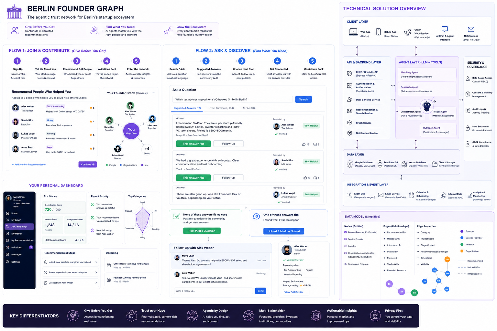
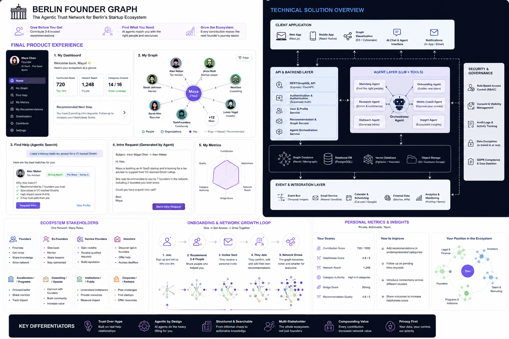

# Product Definition Requirements

# Delta Connector

## 1. Product Name

**Delta Connector**

## 2. One-Liner

Delta Connector turns hidden startup ecosystem knowledge into a trusted, searchable, agentic network where founders and stakeholders find the right people, answers, services, and resources through peer-validated recommendations.

## 3. Core Promise

No founder should need the right private WhatsApp group to know whom to ask, who to trust, or what to do next.

Delta Connector makes hidden ecosystem knowledge visible, structured, reusable, and actionable.

## 4. Product Category

Delta Connector is a:

* peer-validated ecosystem graph
* agentic startup navigator
* trusted Q&A and knowledge reuse layer
* multi-stakeholder founder support network
* personal and public trust-metric system

It is not only a directory, not only a community, and not only a marketplace.

It is the connective tissue between founders, service providers, investors, accelerators, coworking spaces, institutions, mentors, and ecosystem operators.

---

# 5. Problem Statement

At every stage of building a company in Berlin, founders rely on informal networks to find critical resources:

* the right lawyer
* the right accountant
* the right tax advisor
* the right co-founder
* the right investor
* the right housing contact
* the right workspace
* the right mentor
* the right public funding program
* the right answer to a very specific founder question

This knowledge exists, but it is fragmented across:

* WhatsApp groups
* private founder chats
* informal introductions
* accelerator alumni networks
* investor networks
* community managers
* service-provider relationships
* personal founder experience

The result:

* every founder starts from scratch
* international founders are disadvantaged
* trusted resources remain invisible
* good answers are repeatedly given but not reused
* founder knowledge does not compound
* service providers are difficult to evaluate
* institutions cannot see where founders are stuck
* the ecosystem has infrastructure, but no connective intelligence layer

Delta Connector solves this by turning recommendations, answers, relationships, and founder experience into structured, trusted, reusable ecosystem knowledge.

---

# 6. Product Vision

Delta Connector becomes the trusted operating layer for Berlin’s startup ecosystem.

It helps users answer four questions:

1. **Who can help me?**
2. **What has already been answered?**
3. **Who is trusted for this exact problem?**
4. **What should I do next?**

The product combines:

* peer-sourced recommendations
* confirmed stakeholder profiles
* reusable answers
* agentic matching
* personal knowledge
* ecosystem graph data
* public and private trust metrics
* structured contribution loops

The long-term ambition is to become a living, trusted ecosystem map that improves every time someone contributes.

 

---

# 7. Strategic Positioning

## Main Positioning

**Delta Connector is the agentic trust layer for Berlin’s startup ecosystem.**

## Alternative Positioning

* The hidden founder network, structured and actionable.
* The trusted answer and people graph for startup builders.
* A pay-it-forward ecosystem network for founders and stakeholders.
* The agentic connector between startup questions, trusted answers, and the people who can help.
* Not who you know — but who really helped whom.

## Core Narrative

Berlin has startup infrastructure.
But founders lack the trusted map.

Delta Connector creates that map by combining:

* who helped whom
* what questions were answered
* which answers actually helped
* which stakeholders are trusted
* which resources fit which founder context
* which people can provide the next best intro or answer

---

# 8. Target Users

## 8.1 Founders

Primary users.

Needs:

* trusted recommendations
* answers to concrete founder questions
* stage-specific guidance
* warm intros
* service-provider discovery
* Berlin onboarding support
* visibility into ecosystem resources
* personal network metrics

## 8.2 Ex-Founders

High-value knowledge contributors.

Needs:

* give back to the ecosystem
* answer questions
* recommend useful people
* mentor relevant founders
* build visible category authority

## 8.3 Service Providers

Examples:

* lawyers
* tax advisors
* accountants
* recruiters
* relocation providers
* grant consultants
* visa support providers

Needs:

* trusted visibility
* founder validation
* qualified requests
* category-specific reputation
* ability to invite founders who can validate their work

## 8.4 Investors

Needs:

* opt-in access to relevant founders
* paid ecosystem access
* warm intro paths
* founder trust signals
* sector and stage discovery
* ability to offer office hours or answers

Investor access is controlled and paid.

## 8.5 Accelerators / Incubators

Needs:

* onboard cohorts faster
* structure mentor and alumni knowledge
* provide resources
* understand repeated founder pain points
* strengthen program impact

## 8.6 Coworking Spaces

Examples: Delta Campus-style ecosystem hubs.

Needs:

* become visible as physical ecosystem nodes
* show community value beyond workspace
* connect founders to people, events, mentors, and services
* support local startup onboarding

## 8.7 Public Institutions

Needs:

* understand ecosystem bottlenecks
* provide official resources
* support founders better
* receive aggregated, anonymized insights

## 8.8 Corporate Partners

Needs:

* connect with relevant startups
* post challenges
* offer pilots
* provide customer access
* participate as ecosystem contributors

---

# 9. Core Product Principles

## 9.1 Trust-Unlocked, Not Hard-Gated

Users can join the network first.

Contribution is encouraged after joining and improves trust, visibility, access, and recommendation power.

Users can recommend 1–8 people once they have joined.

This avoids the feeling of contact harvesting while preserving the give-before-you-get principle.

## 9.2 Confirmed Opt-In Only

Invited people do not appear publicly in the graph before confirming and opting in.

Before confirmation, they remain private pending invite records visible only to the inviter.

## 9.3 Peer Validation Is the Trust Anchor

Stakeholders can join from day one, but to become fully verified they need peer validation from 8 founders in the network.

## 9.4 Multi-Label Identity

Each actor can have more than one label.

Example:

* Founder + Angel Investor
* Lawyer + Mentor
* Coworking Space + Community Hub
* Accelerator + Investor + Program Provider
* Ex-Founder + Advisor + Operator

## 9.5 Anonymized Trust First

Users initially see anonymized trust evidence.

Example:

> Recommended by 4 verified founders in your stage.

The identity of the recommender or answer provider can be revealed when there is a meaningful interaction, for example:

* the answer helped the user
* the user requests a follow-up
* both sides consent to connection
* the answer provider has opted into visibility

## 9.6 Agentic, But Human-Controlled

The system can recommend, summarize, draft, match, and prepare actions.

It must not send messages, reveal private data, or make binding commitments without user approval.

## 9.7 Public Metrics Only Above Threshold

Centrality and authority metrics are private by default.

They become publicly visible only when a user or organization crosses a trust threshold and opts in.

## 9.8 Paid Investor Access Without Ranking Influence

Investors may pay access fees.

Payment allows controlled access to opt-in discovery and ecosystem insights.

Payment must not influence ranking, trust score, or recommendation quality.

---

# 10. Core Product Flows

Delta Connector has two main hackathon-visible flows.

---

## Flow 1: Join, Contribute, Build Trust

### Goal

A user joins the network, adds their context, optionally contributes trusted recommendations, and receives private metrics and trust-building suggestions.

### Steps

1. User signs up.
2. User selects stakeholder type.
3. User creates a profile.
4. User enters current needs and can-help-with categories.
5. User can optionally recommend 1–8 people.
6. Recommended people receive an invitation.
7. Invitees only appear after confirming and opting in.
8. User receives private metrics.
9. Agent suggests how to improve contribution, visibility, and trust score.

### Example

Maya joins Delta Connector.

She is:

* non-EU founder
* AI SaaS
* pre-seed
* arriving in Berlin
* looking for housing, Anmeldung, GmbH setup, tax advisor, coworking, and funding help

She optionally recommends:

* a lawyer
* a tax advisor
* a coworking manager
* an angel investor
* a founder mentor

The graph does not show these people publicly until they opt in.

---

## Flow 2: Ask, Discover, Reuse Answers

### Goal

A user asks a question and first receives previous answers, similar to a smart FAQ. If no answer fits, the user can post the question publicly to the network.

### Steps

1. User posts a question.
2. System searches previous answers.
3. Agent shows relevant answer cards.
4. User sees anonymized trust evidence.
5. User can mark an answer as fitting.
6. If the answer fits, it can be saved, uploaded, or accepted as solution.
7. The user can request a follow-up with the person who gave the answer.
8. If no answer fits, user can post the question publicly.
9. New answers become reusable knowledge for future users.
10. Helpful answers improve the answer provider’s trust metrics.

### Example Question

> Which tax advisor is good for a VC-backed GmbH in Berlin?

### Suggested Previous Answers

Answer card:

* answer summary
* category
* founder stage fit
* helpfulness score
* anonymized trust evidence
* answer provider credibility
* number of users who marked it helpful
* option to request follow-up

Example:

> “For VC-backed GmbHs, look for a tax advisor with DATEV, payroll, investor reporting, and fundraising experience. Avoid generalist tax advisors without startup experience.”

Trust evidence:

> Helpful for 12 founders.
> Verified in Tax/Admin.
> Strong match for pre-seed and seed-stage GmbHs.

### User Options

* “This answer fits”
* “Save to my workspace”
* “Request follow-up”
* “Show related people”
* “None of these answers fit — post my question publicly”

---

# 11. Product Goals

## Goal 1: Make Hidden Knowledge Visible

Convert informal founder recommendations and repeated answers into structured, searchable knowledge.

## Goal 2: Improve the Founder Starting Point

Help every new founder find better answers, people, and next actions faster than the previous one.

## Goal 3: Reuse Good Answers

Prevent repeated questions from being answered from scratch.

## Goal 4: Build a Compounding Trust Graph

Every answer, recommendation, validation, and follow-up improves the network.

## Goal 5: Support Multiple Stakeholders

Include founders, ex-founders, service providers, investors, accelerators, coworking spaces, institutions, and corporates.

## Goal 6: Enable Agentic Matching

The agent should match user questions and needs to previous answers, trusted people, and next actions.

## Goal 7: Make Trust Measurable

Users should understand their contribution, helpfulness, category authority, and network position.

---

# 12. Non-Goals for MVP

The MVP should not include:

* full payment processing
* full marketplace
* legal automation
* public leaderboard
* uncontrolled investor discovery
* automatic cold outreach
* social feed
* complete messaging system
* event aggregator
* multi-city expansion
* autonomous contract or provider booking
* visible graph nodes for non-confirmed invitees

---

# 13. MVP Scope

## MVP Name

**Delta Connector MVP**

## MVP Theme

**Trust graph + reusable answers + agentic matching**

## MVP Objective

Demonstrate that a founder can:

1. join the network
2. create a profile
3. optionally contribute recommendations
4. ask a question
5. receive previous trusted answers
6. mark an answer as fitting
7. request a follow-up
8. post publicly if no answer fits
9. see personal trust metrics
10. understand how contribution improves the ecosystem

---

# 14. MVP User Flows

## 14.1 Signup Flow

Required fields:

* name
* email
* stakeholder type
* location
* visibility preference

Stakeholder types:

* Founder
* Ex-Founder
* Investor
* Lawyer
* Tax Advisor
* Accountant
* Mentor
* Accelerator
* Coworking Space
* Public Institution
* Corporate Partner
* Recruiter
* Relocation/Housing Partner
* Other Helper

---

## 14.2 Profile Flow

Founder profile fields:

* company stage
* industry
* founder context
* current needs
* can-help-with categories
* timeline
* budget preference
* preferred language
* visibility settings

Example:

```text
Founder: Maya
Stage: Pre-incorporation
Context: Non-EU founder arriving in Berlin
Industry: AI SaaS
Needs: Visa, housing, GmbH, tax advisor, coworking, funding
Can help with: AI product, pitch feedback
```

---

## 14.3 Optional Recommendation Flow

Users can recommend 1–8 people after joining.

For each recommendation:

* name
* email
* stakeholder label
* help label
* how they helped
* founder stage context
* impact score
* recommendation strength
* would recommend?
* optional warning
* visibility preference

The recommended person remains invisible until confirmed and opted in.

---

## 14.4 Ask & Discover Flow

User asks:

```text
I need a startup-ready tax advisor for a VC-backed GmbH.
```

System returns:

* suggested previous answers
* answer summaries
* trust evidence
* answer helpfulness score
* category fit
* stage fit
* answer provider credibility
* option to mark as fitting
* option to request follow-up
* option to post publicly if none fit

---

## 14.5 Public Question Flow

If no answer fits:

1. User clicks “Post question publicly”.
2. System asks for category and context.
3. User confirms visibility.
4. Question appears in relevant stakeholder feeds.
5. Trusted users can answer.
6. Good answers become reusable answer objects.
7. Helpful answers improve trust metrics.

---

## 14.6 Follow-Up Flow

If an answer fits and the user wants more:

1. User requests follow-up.
2. System checks visibility and consent rules.
3. Answer provider or recommender can be revealed if permitted.
4. Agent drafts follow-up message.
5. User approves before sending.
6. Conversation or intro is initiated.

---

# 15. Key Features

## 15.1 User Profile

Captures who the user is, what they need, and what they can contribute.

Acceptance criteria:

* user can create profile
* user can select multiple labels
* user can edit profile
* profile is used for matching
* visibility settings are stored

---

## 15.2 Stakeholder Labels

Each user or organization can have multiple labels.

Examples:

* Founder
* Ex-Founder
* Investor
* Lawyer
* Tax Advisor
* Mentor
* Accelerator
* Coworking Space
* Institution
* Corporate Partner
* Community Builder
* Recruiter
* Housing Partner

Acceptance criteria:

* actor can have multiple labels
* labels influence matching
* labels can be edited
* labels can be verified through peer validation

---

## 15.3 Help Categories

Each recommendation, answer, question, and resource is linked to help categories.

Categories:

* Legal
* Tax/Admin
* Funding
* Housing
* Workspace
* Visa/Relocation
* Talent/Hiring
* Co-Founder
* Product/Tech
* Sales/GTM
* Public Funding
* Mentoring
* Community
* Customer Access
* Corporate Pilot
* Personal Support

Acceptance criteria:

* a question can have one or more categories
* an actor can be trusted in one or more categories
* category authority is calculated separately

---

## 15.4 Recommendation Receipt

Structured evidence that one actor helped another.

Fields:

* recommender
* recommended person
* category
* help description
* stage context
* impact score
* recommendation strength
* would recommend
* warning
* visibility
* confirmation status

Acceptance criteria:

* recommendation can be submitted
* recommended person receives invite
* recommended person remains invisible until opt-in
* receipt can contribute to trust score after validation

---

## 15.5 Answer Object

A reusable answer given to a founder question.

Fields:

* question
* answer
* answer provider
* categories
* stakeholder context
* stage context
* helpfulness count
* fit confirmations
* follow-up requests
* trust evidence
* visibility level
* created at
* updated at

Acceptance criteria:

* answer can be matched to future questions
* answer can be marked as helpful
* answer can trigger follow-up request
* answer provider gains helpfulness score
* answer can be reused like a smart FAQ result

---

## 15.6 Smart FAQ / Previous Answer Retrieval

Before posting a public question, the system checks existing knowledge.

Matching signals:

* semantic similarity
* category match
* stage match
* stakeholder context
* location context
* helpfulness score
* recency
* answer provider trust score

Acceptance criteria:

* user asks a question
* system returns relevant previous answers
* user can accept an answer
* user can reject all answers and post publicly
* accepted answers improve answer ranking

---

## 15.7 Public Question Posting

When no existing answer fits, user can post publicly.

Acceptance criteria:

* user can post question to network
* question has category and context
* relevant stakeholders can answer
* user can mark answer as fitting
* accepted answers become reusable knowledge

---

## 15.8 Follow-Up Request

Users can ask for follow-up with the person who gave a useful answer.

Acceptance criteria:

* user can request follow-up
* answer provider identity is revealed only under consent rules
* agent drafts follow-up message
* user approves before sending
* follow-up activity updates metrics

---

## 15.9 Graph Visualization

The graph visualizes confirmed actors and relationships.

Visible nodes only include confirmed, opted-in actors.

Graph can show:

* user
* trusted people
* stakeholder types
* help categories
* confirmed recommendation edges
* answer relationships
* follow-up relationships

Acceptance criteria:

* graph shows confirmed nodes only
* graph filters by category
* graph filters by stakeholder type
* graph does not expose unconfirmed invitees

---

## 15.10 Personal Metrics Dashboard

Every user receives private metrics.

MVP metrics:

* Contribution Score
* Helpfulness Score
* Network Reach
* Category Coverage
* Recommendation Quality
* Answer Helpfulness
* Follow-Up Value

Future metrics:

* In-Degree Centrality
* Out-Degree Contribution
* Betweenness Centrality
* Category Authority
* Eigenvector Trust
* Bridge Score
* Reciprocity Risk
* Response Reliability
* Outcome Score

Acceptance criteria:

* user sees own metrics
* metrics are private by default
* metrics update after recommendations, answers, validations, and follow-ups
* agent suggests how to improve metrics

---

## 15.11 Public Authority Badges

Metrics can become publicly visible only above thresholds.

Example badges:

* Highly trusted for Tax/Admin
* Strong connector for International Founders
* Verified Legal Support for Pre-Seed GmbHs
* Helpful Answer Provider in Funding
* Trusted Coworking Node for AI Founders

Threshold for public visibility:

* Trust Score ≥ 80/100
* at least 8 founder validations
* at least 3 independent relationship clusters
* no unresolved trust flags
* confirmed public visibility opt-in

Acceptance criteria:

* public badge only appears after threshold
* user can opt out of public visibility
* badges are category-specific
* no generic public popularity leaderboard in MVP

---

## 15.12 Service Provider Validation

Service providers can invite founders to validate them.

Acceptance criteria:

* provider can request validation
* founder can confirm or reject validation
* provider self-claims have low weight before validation
* 8 founder validations unlock fully verified status
* abuse prevention limits mass validation requests

---

## 15.13 Investor Access

Investors can join with paid access.

MVP may simulate payment status.

Investor rules:

* investors can access opt-in founder discovery only
* investors cannot contact founders without consent
* investors can offer office hours
* investors can answer questions
* investors can request warm intros
* investor payment does not influence ranking

Acceptance criteria:

* investor has stakeholder label
* investor access is marked as paid or unpaid
* founder discovery respects opt-in
* investor cannot bypass privacy rules

---

# 16. Trust Score

## 16.1 Minimum Viable Trust Score

A person or organization is credible for internal matching when:

* Trust Score ≥ 70/100
* at least 3 independent validations
* at least one specific help category
* at least one contextual recommendation or helpful answer
* no unresolved abuse or trust flags

## 16.2 Public Visibility Trust Score

A person or organization can unlock public authority visibility when:

* Trust Score ≥ 80/100
* at least 8 founder validations
* multiple independent recommenders
* confirmed opt-in
* category-specific relevance

## 16.3 Trust Score Levels

|  Score | Meaning             | Product Behavior                 |
| -----: | ------------------- | -------------------------------- |
|   0–39 | Unverified          | Not recommended                  |
|  40–59 | Emerging            | Can appear with low confidence   |
|  60–69 | Promising           | Can appear with caveats          |
|  70–79 | Trusted             | Can be recommended privately     |
|  80–89 | Highly trusted      | Can unlock public category badge |
| 90–100 | Ecosystem authority | Strong public category authority |

## 16.4 MVP Trust Score Formula

Suggested MVP weights:

| Signal              | Weight |
| ------------------- | -----: |
| Founder validations |    25% |
| Impact score        |    20% |
| Answer helpfulness  |    20% |
| Category fit        |    15% |
| Stage/context fit   |    10% |
| Recency             |     5% |
| Confirmation status |     5% |

---

# 17. Agent Behavior

## 17.1 Agent Role

The agent is the ecosystem navigator.

It helps users:

* ask better questions
* find existing answers
* understand trust evidence
* match with people
* generate follow-up messages
* draft intro requests
* suggest next actions
* improve their metrics
* contribute better recommendations

## 17.2 Agent Modes

### Matching Agent

Finds relevant people, answers, and resources.

### Answer Retrieval Agent

Finds previous answers similar to the user’s question.

### Question Routing Agent

Routes new public questions to relevant stakeholders.

### Metric Coach Agent

Suggests how users can improve trust, helpfulness, and category authority.

### Outreach Agent

Drafts intros, follow-up messages, and provider requests.

### Insight Agent

Shows ecosystem patterns and bottlenecks.

## 17.3 Allowed Actions

The agent may:

* recommend previous answers
* recommend people
* explain why a match is relevant
* draft follow-up messages
* draft intro requests
* summarize trusted answers
* suggest missing profile information
* suggest trust-building actions
* create task lists

## 17.4 Forbidden Actions

The agent must not:

* send messages without approval
* reveal private data without consent
* expose unconfirmed invitees
* contact investors without founder opt-in
* rank paid investors higher
* make final legal, tax, immigration, or investment decisions
* modify another user’s profile
* create public badges below threshold

---

# 18. Data Model

## 18.1 Actor

```json
{
  "id": "actor_001",
  "name": "Maya Chen",
  "email": "maya@example.com",
  "actor_type": "person",
  "stakeholder_labels": ["Founder"],
  "location": "Berlin",
  "visibility": "network_only",
  "profile_status": "active",
  "created_at": "timestamp"
}
```

## 18.2 FounderProfile

```json
{
  "actor_id": "actor_001",
  "company_stage": "pre-incorporation",
  "industry": "AI SaaS",
  "founder_context": "non-EU founder",
  "current_needs": ["visa", "housing", "GmbH", "tax advisor", "funding"],
  "can_help_with": ["AI product", "pitch feedback"],
  "timeline": "6 weeks",
  "budget_preference": "lean but investor-ready"
}
```

## 18.3 RecommendationReceipt

```json
{
  "id": "rec_001",
  "from_actor_id": "actor_001",
  "to_person_email": "helper@example.com",
  "to_person_name": "Alex Weber",
  "stakeholder_labels": ["Tax Advisor", "Startup Advisor"],
  "help_categories": ["Tax/Admin", "Funding Readiness"],
  "help_description": "Helped set up DATEV, payroll, and investor reporting for a pre-seed GmbH.",
  "stage_context": "pre-seed",
  "impact_score": 5,
  "recommendation_strength": "strong",
  "would_recommend": true,
  "warning": "Best for VC-backed GmbHs, not solo freelancers.",
  "visibility": "private_until_confirmed",
  "status": "pending_invite",
  "created_at": "timestamp"
}
```

## 18.4 Answer

```json
{
  "id": "answer_001",
  "question_id": "question_001",
  "answer_provider_id": "actor_002",
  "answer_text": "For a VC-backed GmbH, choose a tax advisor with DATEV, payroll, investor reporting, and financing experience.",
  "help_categories": ["Tax/Admin"],
  "stage_context": "pre-seed",
  "helpfulness_count": 12,
  "fit_confirmations": 8,
  "follow_up_requests": 3,
  "visibility": "network_only",
  "created_at": "timestamp"
}
```

## 18.5 Question

```json
{
  "id": "question_001",
  "actor_id": "actor_001",
  "question_text": "Which tax advisor is good for a VC-backed GmbH in Berlin?",
  "detected_categories": ["Tax/Admin"],
  "stage_context": "pre-seed",
  "visibility": "network_public",
  "status": "answered",
  "created_at": "timestamp"
}
```

## 18.6 GraphEdge

```json
{
  "id": "edge_001",
  "source_actor_id": "actor_001",
  "target_actor_id": "actor_002",
  "edge_type": "recommended",
  "help_categories": ["Tax/Admin"],
  "weight": 0.86,
  "impact_score": 5,
  "visibility": "network_only",
  "created_at": "timestamp"
}
```

## 18.7 MatchResult

```json
{
  "id": "match_001",
  "request_id": "question_001",
  "matched_type": "answer",
  "matched_id": "answer_001",
  "match_score": 0.91,
  "reasons": [
    "Similar question answered before",
    "Helpful for 12 founders",
    "Strong Tax/Admin category match",
    "Relevant to pre-seed GmbH setup"
  ],
  "next_action": "Mark as fitting or request follow-up"
}
```

---

# 19. Technical Architecture

## 19.1 Client Layer

* Web app
* Mobile-ready UI
* Graph visualization
* AI chat / agent interface
* Notification interface

Recommended MVP tools:

* Next.js or Lovable-generated React frontend
* React Flow or Cytoscape.js for graph visualization
* Tailwind for UI

## 19.2 API & Backend Layer

Services:

* Authentication service
* User/profile service
* Recommendation service
* Question/answer service
* Graph service
* Matching service
* Agent orchestration service
* Notification service

Recommended MVP tools:

* Supabase Auth
* Supabase Postgres
* Edge functions or simple API layer
* Serverless functions

## 19.3 Data Layer

* relational database for users, profiles, recommendations, questions, answers
* graph representation for actors and relationships
* vector search for previous answer retrieval
* object storage for optional uploads and documents

MVP:

* Supabase Postgres
* pgvector
* simple graph tables

Future:

* Neo4j or Memgraph
* Weaviate or dedicated vector DB
* event log
* audit database

## 19.4 Agent Layer

Core agents:

* Answer Retrieval Agent
* Matching Agent
* Question Routing Agent
* Outreach Agent
* Metric Coach Agent
* Insight Agent

MVP can implement these as one orchestrated LLM prompt with structured outputs.

Future version can use a workflow engine such as LangGraph or custom orchestration.

## 19.5 Security & Governance Layer

Required:

* role-based access control
* consent and visibility management
* audit logs
* data deletion flow
* invitee opt-in flow
* encrypted data at rest and in transit
* anti-abuse controls
* private-by-default metrics

---

# 20. Privacy and Governance Requirements

## 20.1 Invitee Privacy

Invited people remain invisible until they confirm and opt in.

## 20.2 Visibility Levels

| Level         | Description                           |
| ------------- | ------------------------------------- |
| Private       | only visible to user                  |
| Pending       | visible only to inviter               |
| Network-only  | visible to verified members           |
| Category-only | visible in relevant matching contexts |
| Public        | explicitly published                  |
| Aggregated    | anonymized insight only               |

## 20.3 User Control

Users must be able to:

* edit profile
* hide profile
* delete account
* decline invitation
* control visibility
* control investor visibility
* control recommender reveal
* opt into public badges

## 20.4 Anti-Abuse Rules

* no mass invite upload
* no visible graph nodes without opt-in
* no paid ranking
* no public leaderboard in MVP
* reciprocal validation loops are down-weighted
* suspicious validation patterns are flagged
* service-provider self-claims weighted lower than founder validations

---

# 21. Pilot Strategy

## First Pilot Stakeholders

The first pilot should include:

1. Founders
2. Accelerators
3. Lawyers
4. Coworking spaces, including Delta Campus-style hubs

## Why These Groups

### Founders

They provide real questions, needs, and recommendations.

### Accelerators

They bring cohorts and structured startup journeys.

### Lawyers

They are a high-value, high-trust provider category.

### Coworking Spaces

They connect the physical and digital ecosystem.

## Later Stakeholders

* tax advisors
* investors
* relocation partners
* public institutions
* universities
* corporate innovation teams
* recruiters
* founder communities

---

# 22. Success Metrics

## MVP Metrics

| Metric                                         |                    Target |
| ---------------------------------------------- | ------------------------: |
| Signup completion rate                         |                      >60% |
| Profile completion rate                        |                      >70% |
| Users contributing at least one recommendation |                      >40% |
| Average recommendations per contributor        |                       2–5 |
| Question-to-suggested-answer rate              |                      >70% |
| Suggested answer accepted as fitting           |                      >40% |
| Public question posting after no fit           |                      >20% |
| Follow-up request rate                         |                      >15% |
| User understands trust evidence                | >80% qualitative approval |

## Network Metrics

| Metric                  | Meaning                    |
| ----------------------- | -------------------------- |
| Confirmed actors        | opt-in network growth      |
| Recommendation receipts | trust graph growth         |
| Helpful answers         | reusable knowledge growth  |
| Fit confirmations       | answer quality             |
| Follow-up requests      | expert connection value    |
| Founder validations     | stakeholder trust          |
| Category coverage       | ecosystem completeness     |
| Cross-cluster edges     | connective tissue strength |

---

# 23. Hackathon MVP Build Plan

## Must Build

### 1. Landing Page

Message:

```text
Delta Connector
The agentic trust network for Berlin’s startup ecosystem.
```

CTA:

```text
Join the network. Ask better questions. Find trusted answers and people.
```

### 2. Signup/Profile

Fields:

* name
* email
* stakeholder type
* labels
* needs
* can-help-with
* visibility settings

### 3. Optional Recommendation Contribution

User can add 1–8 recommendations.

Show clearly:

```text
Recommended people only appear after they confirm and opt in.
```

### 4. Ask & Discover Interface

User asks a question.

System displays:

* previous answers
* trust evidence
* helpfulness score
* answer provider credibility
* “This answer fits”
* “Request follow-up”
* “Post publicly”

### 5. Public Question Flow

If no answer fits, user posts the question publicly.

### 6. Graph View

Show confirmed sample nodes and relationships.

Do not show pending invitees as public nodes.

### 7. Personal Metrics

Show:

* Contribution Score
* Helpfulness Score
* Answer Helpfulness
* Category Authority
* Network Reach
* Trust Score

### 8. Follow-Up Draft

Agent generates a follow-up message to the answer provider.

---

# 24. Demo Scenario

## Persona

Maya is a non-EU AI SaaS founder arriving in Berlin in six weeks.

She needs:

* housing
* Anmeldung
* GmbH setup
* tax advisor
* coworking
* pre-seed funding

## Demo Flow

1. Maya joins Delta Connector.
2. She creates her founder profile.
3. She optionally recommends three people who helped her.
4. The system explains that they remain private until confirmed.
5. Maya asks:

```text
Which tax advisor is good for a VC-backed GmbH in Berlin?
```

6. The system shows previous answers.
7. Maya sees one answer with strong trust evidence.
8. She marks: “This answer fits.”
9. The answer provider becomes available for follow-up under consent rules.
10. The agent drafts a follow-up message.
11. Maya sees her dashboard update:

    * Answer saved
    * One helpfulness signal added
    * Recommended next action: prepare tax advisor outreach
12. If no answer had fit, Maya could post publicly to the network.

## Demo Closing Line

```text
Every question answered once becomes a better starting point for the next founder.
```

---

# 25. Roadmap

## Phase 0: Hackathon Prototype

* signup
* profile
* optional recommendations
* previous answer retrieval
* public question fallback
* graph mock
* metrics dashboard
* follow-up draft

## Phase 1: Private Beta

* real invitation flow
* invitee confirmation
* answer database
* basic semantic search
* stakeholder passports
* founder validation
* simple email notifications

## Phase 2: Trust Layer

* trust scoring
* category authority
* 8-founder validation threshold
* public badges
* abuse detection
* reciprocity down-weighting
* moderation flows

## Phase 3: Agentic Ecosystem OS

* specialized agents
* personalized founder roadmap
* provider matching
* investor access layer
* accelerator dashboards
* coworking integrations
* institution insights

## Phase 4: Scaled Ecosystem Infrastructure

* paid investor access
* advanced analytics
* multi-city expansion
* partner APIs
* official resource integrations
* full graph intelligence layer

---

# 26. Open Questions Remaining

1. What should the exact investor access fee be?
2. Should coworking spaces have organization-level dashboards in MVP or only later?
3. Should public questions be visible to the whole network or category-specific groups only?
4. Should “This answer fits” require a short explanation to improve answer quality?
5. Should answer providers be rewarded with public badges before full trust score thresholds?
6. Should accelerators be able to create private sub-networks for cohorts?
7. Should Delta Connector support anonymous public questions?
8. Should users be able to export their personal knowledge and saved answers?
9. Should follow-ups happen inside the product or through email?
10. Should Delta Connector begin Berlin-only or use Berlin as the first visible ecosystem while keeping the model city-agnostic?

---

# 27. Final Product Definition

Delta Connector is a trust-unlocked, agentic ecosystem network for Berlin’s startup ecosystem.

It helps founders and stakeholders discover trusted answers, people, services, and resources by combining peer-validated recommendations, reusable Q&A, stakeholder profiles, graph-based trust metrics, and AI-assisted matching.

Users can join first, contribute recommendations later, and build trust over time. Invited people only become visible after confirming and opting in. Previous answers are reused like a smart FAQ, and new public questions improve the network for everyone.

The product is designed around one principle:

## Every contribution should make the next founder’s starting point better.

## Final Hackathon Build Sentence

Build a product where users join Delta Connector, ask a founder question, receive trusted previous answers, mark one as fitting or post publicly, optionally contribute recommendations, and see how their actions improve their trust graph and ecosystem value.
